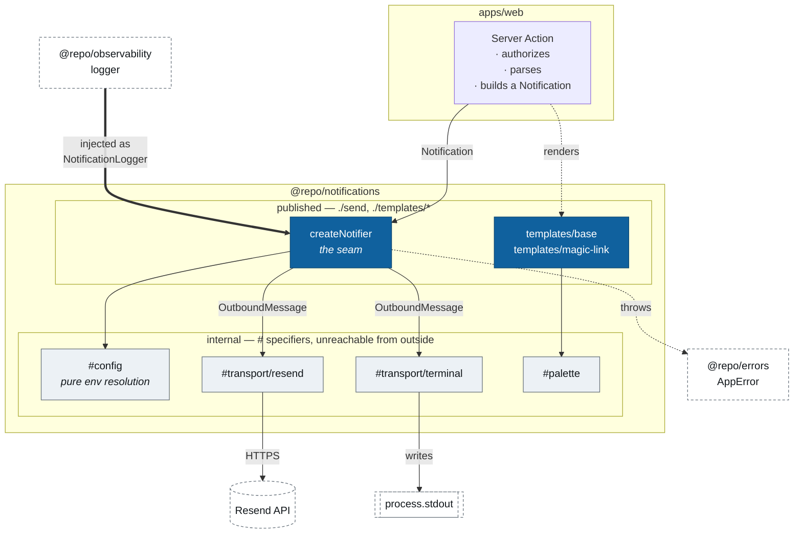
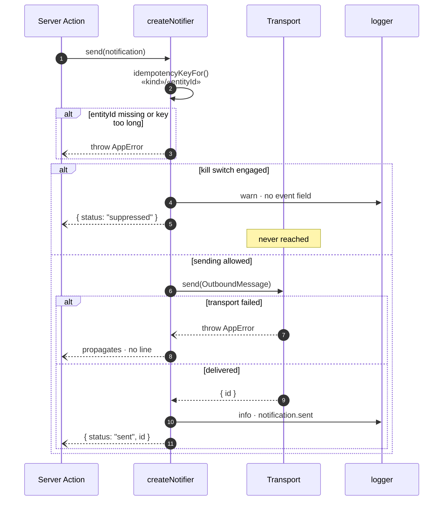
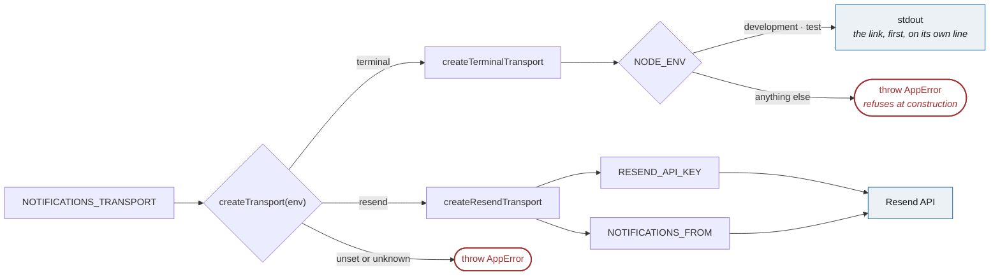
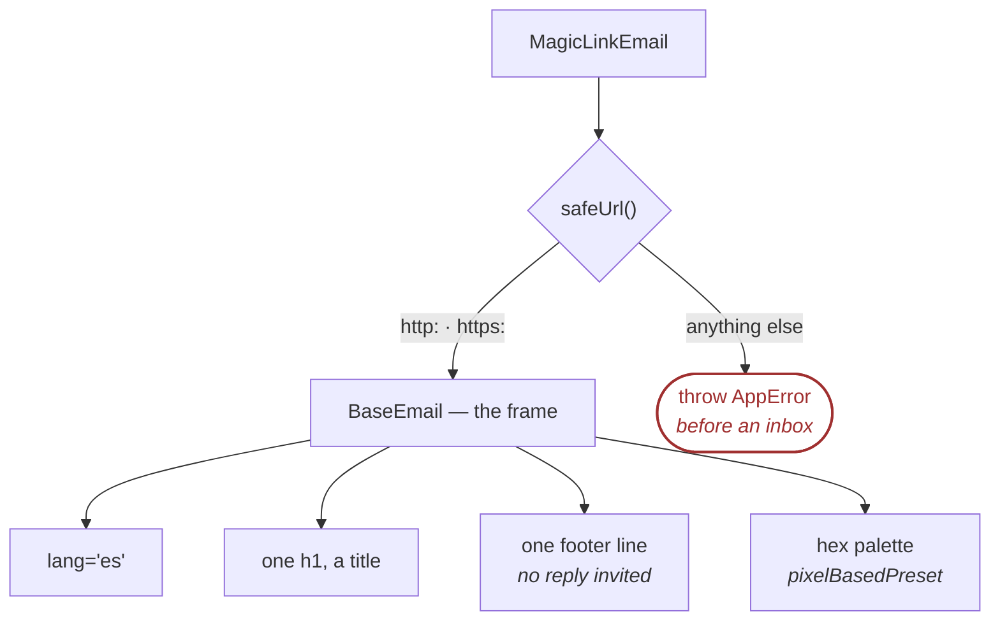

# `@repo/notifications`

**The only door out to a person.** Every email this product sends goes through one seam, and a channel is added by implementing that seam — never by editing a call site ([intent Q1](../../docs/efforts/0002-profile-to-contact-exchange/intent.md), [DD14](../../docs/efforts/0002-profile-to-contact-exchange/spec.md)).

Server-only. One workspace dependency, `@repo/errors`.

## Why it is shaped this way

**A send is the one irreversible act in this system.** An email is in an inbox and a phone number is on a stranger's screen; there is no undo, no rollback and no deploy that takes it back. Three things follow, and all three ship _with_ the seam rather than after it — without them the blast radius of a bad send is not even knowable:

- a **kill switch** that stops everything without a deploy,
- one **log line per send**, carrying ids and never an address,
- an **idempotency key** on every call, so a retry after a timeout is not a second delivery.

## The shape



**The `exports` map is the boundary, not a convention.** Only `./send` and `./templates/*` are published; an unexported subpath is unresolvable under pnpm's isolated store, so a call site cannot build a `Resend` client of its own and route around the kill switch. `apps/web/notifications-boundary.test.ts` asserts both directions against **Node's own resolver** — the algorithm `next build` uses.

**Note the arrow that points _in_.** The logger is injected, not imported. The spec's dependency graph gives this package one workspace dependency and it is `@repo/errors`, so the seam declares the shape it needs — `NotificationLogger`, structurally `{ info, warn }` — and takes it as an argument. `pino`'s `Logger` satisfies it, and that is proven in `apps/web`, because this package cannot import the thing it would prove it against.

## What happens on a send



**The key is computed before the switch is read**, so a malformed one is loud even while sending is off — a bug that would otherwise surface only the day the switch came back on.

**A refusal is a value; a failure is a throw.** That is CLAUDE.md's _"thrown is reported; returned is logged"_ applied to the two ways a send does not happen. The kill switch working as designed is not an incident and must not spend a Sentry event. A transport that failed is one — and it must be loud, because `resend.emails.send()` returns `{ data, error }` rather than throwing, which is the vendor's own most-cited mistake and exactly the shape that would make DD9's _"the send failed, the exchange still commits"_ fail **silently**.

**The suppression line is a `warn` with no `event` field.** [DD11](../../docs/efforts/0002-profile-to-contact-exchange/spec.md) closes the `info` `event` vocabulary at fourteen members (C40); a fifteenth arrives through a spec amendment, not a judgment call at Build time. A suppressed send is not a safety-relevant transition, so it does not join that list. There is a test asserting the absence.

## Two transports, one interface



`createTransport(env)` is the composition point, so a Server Action asks for a notifier rather than choosing a channel. A call site branching on `NODE_ENV` would have broken intent Q1's rule while looking like compliance.

**Each branch resolves only what it needs.** The `terminal` branch never _asks_ for `RESEND_API_KEY` — not "ignores it", never asks — which is what lets the whole sign-in loop run with no credential, no verified domain and no mailbox.

### The development inbox

`NOTIFICATIONS_TRANSPORT=terminal` prints each notification to the terminal running `pnpm dev`:

```
──────────────────────────────────────────────────────────────────────────────
  magic-link  →  ana@example.com
  Tu enlace para entrar a Recomencemos

  http://localhost:3000/api/auth/magic-link/verify?token=9f3b1c7e2a

  Recomencemos

  TU ENLACE PARA ENTRAR

  Pediste un enlace para entrar a Recomencemos. Ábrelo desde este mismo teléfono.
  …
──────────────────────────────────────────────────────────────────────────────
```

The link comes first, on a line of its own, deduplicated — copying it is a double-click rather than a hunt through a wrapped paragraph. It prints the **plain-text alternative**, so the development loop doubles as a standing check on the body NFR20 requires every template to ship.

**It is available in development only, enforced twice.** `NOTIFICATIONS_TRANSPORT` has no default and an unset value throws — neither answer is safe in both places, since `resend` by default mails a stranger from an unwarmed domain on a first loop and `terminal` by default makes a real deploy send nothing at all. And the transport refuses to construct outside `NODE_ENV` `development`/`test`: an **allowlist**, not a `production` blocklist, because `staging`, `preview`, a typo and `undefined` would each otherwise read as permission to swallow mail. It refuses at construction, so the failure is a process that will not start rather than a request that quietly delivered nothing.

## Templates

React Email components, rendered by the transport rather than by the caller. `<BaseEmail>` is the product's frame; everything else sits inside it.



**Escaping is React's, by construction.** DD7 called email _"the one rendering path where React's escaping does not apply"_; with React Email the templates **are** React components rendered through `render()`, so the exception dissolves. What remains is a three-clause rule: no `dangerouslySetInnerHTML`, no `<Markdown>` over user-supplied text, and **no `href` built from user text**.

The third clause is not a restatement of the first two (C48). Escaping constrains element _content_ and leaves an _attribute_ alone, so a URL-valued attribute is the one injection this seam still admits — into an inbox, past a control everyone believes is closed. `safeUrl()` is the mechanism: a whitelist of `http:`/`https:`, refused at render. A blocklist would mean the next scheme somebody invents passes by default.

**The palette is a hex copy** of [`DESIGN.md`](../../DESIGN.md)'s `oklch()` tokens, because email clients support neither `oklch()` nor custom properties. There is no build step that could derive it — but the drift is checked rather than watched for: [`apps/web/design-tokens.test.ts`](../../apps/web/design-tokens.test.ts) re-derives every hex from the design system's `globals.css`, asserts the `oklch()` each doc comment claims, and re-measures the six contrast pairs. A colour that moves in one file and not the other goes red. Every pair clears WCAG AA; the numbers are in that module.

## Configuration

| Variable                    | Required      | What it does                                                                                                                    |
| --------------------------- | ------------- | ------------------------------------------------------------------------------------------------------------------------------- |
| `NOTIFICATIONS_TRANSPORT`   | always        | `terminal` or `resend`. No default — an unset or unrecognised value throws                                                      |
| `NOTIFICATIONS_KILL_SWITCH` | no            | Empty, `off`, `false`, `0`, `no` leave sending on. **Everything else engages it**, a typo included                              |
| `RESEND_API_KEY`            | `resend` only | Never in a `.env` file in git — `turbo.json` declares `.env*` a `build` input                                                   |
| `NOTIFICATIONS_FROM`        | `resend` only | A real address on the sending subdomain. Still **never `noreply@`**. There is no `NOTIFICATIONS_REPLY_TO` beside it — see below |

**There is no `NOTIFICATIONS_REPLY_TO`, and its absence is a decision rather than an omission.** DD14 asked for a monitored `Reply-To` — a woman who replies to an Offer notification must reach a person — and this package resolved one until `mail.recomencemos.online` was configured in Resend as **send-only**. A send-only subdomain publishes no MX record, so nothing receives, and a `Reply-To` naming a mailbox that does not exist is a dead end asserted instead of merely present. Without the header, a reply goes to `NOTIFICATIONS_FROM`, finds no MX, and the sender's own provider bounces it within seconds: she is told, rather than left waiting for an answer nobody will write.

The frame's footer lost its invitation for the same reason. It was **removed rather than softened** — a line reading _this address does not read replies_ is the same dead end, printed. The variable, the header, the prop and the sentence all come back on the day a mailbox exists, and not before. The amendment is recorded against DD14 in [the spec](../../docs/efforts/0002-profile-to-contact-exchange/spec.md).

The kill switch and the transport variable fail in opposite directions, and that is deliberate. The kill switch can afford to read a typo as _engaged_, because a refusal is loud and a send is not undoable. The transport variable has no safe direction at all, so it refuses instead of guessing.

## Working on it

```sh
pnpm --filter @repo/notifications email   # React Email preview server, no sending
pnpm --filter @repo/notifications test    # 95 tests, none touching the network
```

Tests substitute the transport rather than mocking it into something claiming to be an integration. `src/transport/resend.test.tsx` is named for what it is: a unit test of the `{ data, error }` contract, proving nothing about delivery. The only claim that Resend delivers mail is a message in a real inbox, and that is a runbook act.

Testing against Resend uses the vendor's own simulators — `delivered@resend.dev`, `bounced@resend.dev`, `complained@resend.dev` — never an invented address at a real provider, which bounces and damages the reputation NFR27 measures.
